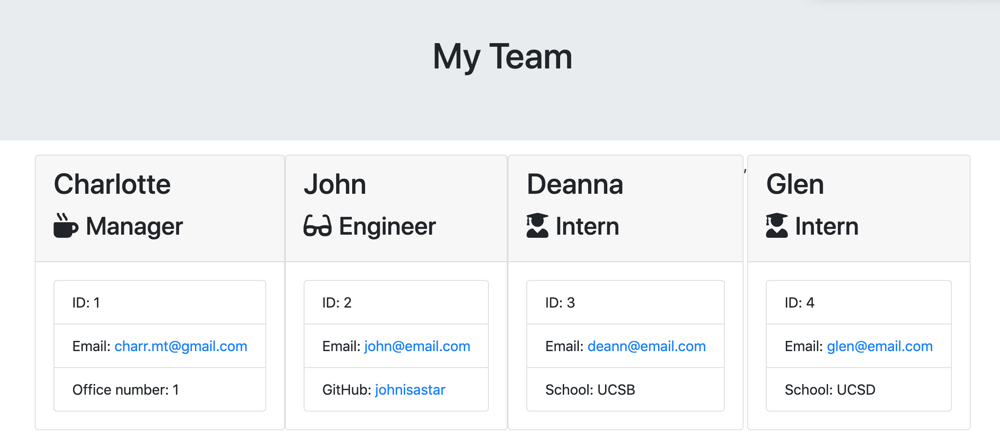

#  **Team Template Builder** #

- [GitHub](https://github.com/charrmountain/team-builder)

## Table of Contents

- [Description](#description) 

- [Visual](#visual) 

- [Usage](#usage) 

- [Contributing](#contributing) 

- [Tests](#tests) 

- [Support](#support) 

## **Description**

-  A software engineering team generator command line application that prompts the user for information about the team manager and then information about the team members.

    - ### **HTML pages:**
         1. [team.html](team.html) is the main html page that will be created after user runs the application
        
     - **HTML Templates:**

          - [templates](/Users/Charlotte/Coding-Bootcamp/Homework/team-builder/templates) folder contains all the HTML templates for each employee.

    - ### **JavaScript pages:**
         1. [app.js](app.js) is the main JavaScript to run application
         2. [lib](/Users/Charlotte/Coding-Bootcamp/Homework/team-builder/lib) folder contains all the JavaScript files for each employee.
         3. [test](/Users/Charlotte/Coding-Bootcamp/Homework/team-builder/test) folder contains all the tests for each JavaScript file for each employee.

    - ### **Style Sheets** (used on all HTML pages)**:**
         3. [style.css](style.css) (created by Coding-Bootcamp)

## **Visuals**

       - Example of the team.html that will be created

## **Usage**
- A team building command line based application that allows the user to Generates a 'team.html' in the [output](/Users/Charlotte/Coding-Bootcamp/Homework/team-builder/output) folder.

- Please run the following tests before beginning:
```
npm i
```

## **Tests**
- All tests are located in the [test](/Users/Charlotte/Coding-Bootcamp/Homework/team-builder/test) file. There is a test for each employee.

## **Support**
    
[](https://github.com/charrmountain)
- e-mail: charr.mt@gmail.com